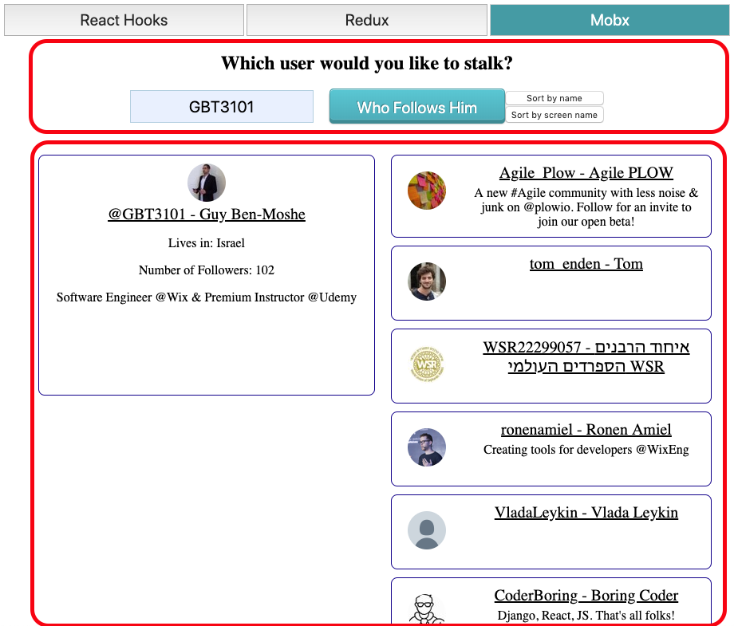

# State Management Workshop

## Description
This workshop shows different state management solutions for a classic scenario - form, data and an infinite list.

## Prerequisite

You must have a [Twitter API Developer](https://developer.twitter.com/en/apply-for-access) License in order to make this project work!
Insert your `CONSUMER_API_KEY, CONSUMER_SECRET, ACCESS_TOKEN, ACCESS_SECRET` inside `twitter-keys.ts` file in the root of this project before you start.
Project developed with `node 9.8.0`, `npm 5.7.1`, and tested only on `Google Chrome`.


## Installation & Execution
```
git clone https://github.com/GBT3101/twitter-thing.git
cd twitter-thing
npm install
npm start
```
Application is availble in `localhost:3001`.

## High Level Architecture


## Instructions
For this workshop, there are only 3 folders you should focus on:

1. React Hooks - [./src/client/hooks](./src/client/hooks)
2. Mobx - [./src/client/mobx](./src/client/mobx)
3. Redux - [./src/client/redux](./src/client/redux)

You can learn about the entities being used in this project [here](./src/shared).

Further instructions appears in each folder, it's highly recommended to complete the workshop in the order defined above.

### Tips

* In every place you need to write code you will have a comment `YOUR CODE HERE` with the number of the task and hints, you should write code until the `// UNTIL HERE` comment.
* Specific lines you need to edit are attached with a `// HERE` Comment.
* Follow the instructions carefuly task by task, read attached resources when you are stuck.

## App Usage - Our Goal
At the top of the screen you can choose between `Mobx`, `Redux`, or `React Hooks` as your state management system.
Enter the User Screen Name and watch it's details and followers.
Followers load in batches of 30, every time you scroll down another 30 will load until all followers can be seen on screen.
After getting a user results, 2 new buttons will pop that allows you to sort followers by their name / screen name.


